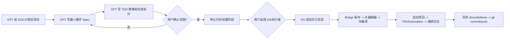

# 《洋流》最小循环规格与自动化工作流

> 状态：讨论稿 / docs-only  
> 来源：`C:\Users\shxuw\Desktop\洋流.docx`、当前 `L_WaterOcean` MVP、项目生产单元与自动化链路  
> 本阶段原则：GPT 负责需求拆解、边界冻结、Spec、TDD 策略和工作流；到代码执行阶段停止，由用户选择 DS/代码执行者。

## 1. 结论先行

当前最小循环建议不要回到“可玩邮轮开局”，而是继续沿用小船生存主循环：

1. 玩家以 45-60 度俯视第三人称出现在海面小船平台。
2. 体力、水分、饱食度持续变化，缺水/饥饿带来失败压力。
3. 玩家通过 `F` 交互拾取漂浮资源，通过背包使用食物/水恢复状态。
4. 玩家通过合成系统消耗资源制造基础模块，再在允许放置区域扩展小船。
5. 时间按“事件点”推进；先做可测试的抽象事件，不先做完整钓鱼、潜水、上岛关卡。
6. 存活到第 8 天 / 21 个事件点后触发海岸终点，完成通关。

这条线最符合学生毕设的风险控制：玩法闭环可演示、边界清楚、测试可写、资产缺失时可用立方体替代。

## 2. 需求文档提炼

从 DOCX 里提炼出的核心目标：

| 原始设计点 | 最小循环处理 |
|---|---|
| 生存、大众休闲向 | 操作减少到 WASD/左键移动、`F` 交互、背包/合成 UI。 |
| 45-60 度俯视第三人称 | 继续使用当前 TopDown 相机结构。 |
| 邮轮收集 -> 海难 -> 小船生存 | MVP 跳过可玩邮轮，开局给初始物资；邮轮以后做序章。 |
| 保证体力、水分、饱食度 | 作为第一批核心系统，必须 UI 可见、测试可读。 |
| 潜水、钓鱼、上岛 | 先列入事件系统扩展，不在当前代码阶段实现。 |
| 7 天 / 21 个事件后到岸 | 作为最小可通关终点，先用海岸结算界面或触发器占位。 |
| 多场景：邮轮、小船、海底、小岛、海岸 | 当前只做小船海面 + 终点占位；其他场景作为事件结果或后续地图。 |
| 平面高饱和 2.5D | 现阶段立方体/基础材质占位，但保留替换 Actor 资产路径。 |

## 3. 为什么 Pawn 不是 `BP_TopDownCharacter`

### 3.1 当前事实

当前 Ocean MVP 的目标玩家类是 `BP_OceanSurvivorCharacter`，它基于项目 C++ `AOceanCharacter`，已经挂载 Ocean 专用组件：

- `OceanInventory`
- `OceanSurvival`
- `OceanInteraction`
- `OceanBuild`
- TopDown 相机与移动基础

当前控制器是 `BP_OceanMVPPlayerController`，负责保留左键点地移动，同时新增 WASD、`F`、`B`、`R`。

### 3.2 这不是错误，而是“模板角色”和“项目角色”的分层

`BP_TopDownCharacter` 更像 UE 模板遗留资产，适合作为参考或回退；`BP_OceanSurvivorCharacter` 是《洋流》的可玩角色入口。  
如果直接把 Pawn 改回 `BP_TopDownCharacter`，短期看起来“名字熟悉”，但会把 Ocean 的生存、背包、建造、交互链路拆断。

### 3.3 主要隐患

| 情况 | 隐患 | 建议 |
|---|---|---|
| Map/GameMode 使用 `BP_OceanSurvivorCharacter` | 正常；Ocean 组件和测试都对齐。 | 保持。 |
| 全局 `DefaultEngine.ini` 仍指向 TopDown 默认 GameMode | 如果从非 `L_WaterOcean` 地图启动，可能生成模板 GameMode/Pawn。 | 代码阶段确认项目默认地图和全局 GameMode 是否要切到 Ocean MVP。 |
| 强行改回 `BP_TopDownCharacter` | 可能缺 `OceanInventory/OceanSurvival/OceanInteraction/OceanBuild`，HUD/交互/建造测试失效。 | 不推荐。 |
| 保留两个角色资产 | 维护成本增加，容易在编辑器里选错 Pawn。 | 文档和命名中明确：`BP_OceanSurvivorCharacter` 是 MVP 玩家类，TopDown 资产只作模板参考。 |
| `BP_TopDownCharacter` 如果实际继承了 `AOceanCharacter` | 组件风险降低，但默认数据、输入、建造模块仍可能没配置。 | 仍需通过脚本验证默认模块、输入和 GameMode。 |

### 3.4 对玩家体验的影响

不使用 `BP_TopDownCharacter` 不代表删除 TopDown 玩法。  
正确目标是：保留模板点地移动语义，但把可玩 Pawn 收敛到 Ocean 专用角色。这样左键移动、WASD 微操、`F` 交互、状态/背包/建造可以在同一个角色上稳定叠加。

### 3.5 Paper2D / HD2D 角色不会改变 Pawn 结论

现在补充一个视觉方向：玩家角色后续需要走 Paper2D / HD2D 表现。这个决定不应该把 Pawn 改回 `BP_TopDownCharacter`，也不应该重新写一个完全脱离 Ocean 组件的新 Pawn。
推荐做法是保留 `BP_OceanSurvivorCharacter` 作为 Gameplay Pawn，只把它的可视层替换为 Paper2D Sprite / Flipbook 组件：

- 胶囊体、移动、交互、背包、生存、建造仍由 `AOceanCharacter` / `BP_OceanSurvivorCharacter` 承担。
- Paper2D 只负责角色外观、朝向、待机/移动/交互动画。
- Skeletal Mesh 可隐藏或移除可见性，但不能移除 Ocean 组件。
- 角色碰撞仍以 Capsule 为准，Sprite 不参与主碰撞，避免 2D 贴片和建造/拾取碰撞互相干扰。
- HD2D 的核心是“2D 角色 + 3D 水面/平台/灯光/后期”的表现组合，不是把整个项目改成横版 2D。

备选方案对比：

| 方案 | 优点 | 风险 | 结论 |
|---|---|---|---|
| `BP_OceanSurvivorCharacter` + PaperFlipbook 视觉组件 | 保留现有生存/建造/交互链路；改动最小。 | 需要处理 Sprite 朝向和相机 billboarding。 | 推荐。 |
| 新建 Paper2D 专用 Pawn | 表现层干净。 | 要重接输入、交互、背包、建造和 HUD，容易回归。 | 暂不推荐。 |
| 只用材质平面/贴图 Billboard，不启用 Paper2D | 技术最轻。 | 不满足“用 Paper2D 做 HD2D 角色”的目标，动画资产管理弱。 | 只可作临时占位。 |

## 4. 最小循环系统清单

### 4.1 生存数值

| 数值 | MVP 作用 | 默认建议 | 边界 |
|---|---|---|---|
| 体力 | 事件行动资源；休息可恢复。 | 0-100，事件消耗 20，休息恢复 25。 | 当前不做跑步体力；先不把 WASD 移动和体力绑定。 |
| 水分 | 脱水压力。 | 每事件扣除固定量；饮水恢复。 | 水分为 0 后进入危险状态，不立刻复杂疾病。 |
| 饱食度 | 饥饿压力。 | 每事件扣除固定量；食物恢复。 | 饱食度为 0 后进入危险状态，不先做营养/腐烂。 |
| 健康/死亡 | 失败条件承载。 | 可先做隐藏健康或“危险计数”。 | 不建议一开始做复杂血条、伤口、疾病。 |

推荐失败规则：水分或饱食度为 0 后，每个事件点累积危险；危险达到阈值则 Game Over。这样比“归零立即死”更休闲，也便于调参。

### 4.2 回复方式

| 回复方式 | 输入/来源 | 效果 | MVP 边界 |
|---|---|---|---|
| 使用食物 | 背包使用 | 恢复饱食度。 | 不做烹饪质量、腐烂、饱腹上限扩展。 |
| 使用淡水 | 背包使用 | 恢复水分。 | 海水不能直接喝；淡水来源先用漂浮物资/雨水事件。 |
| 休息 | 事件选择 | 恢复体力，推进时间。 | 夜晚强制事件以后再做。 |
| 雨水收集器 | 合成模块 | 雨天或事件后产水。 | 第一版可做成“事件结算时给水”的占位逻辑。 |

### 4.3 背包系统

最小背包不是完整 RPG 背包，而是“可堆叠资源 + UI 可操作”：

- 资源类型：木材、塑料/碎片、食物、淡水、信号物。
- 插槽：先固定 8-12 格，资源同类堆叠。
- 失败反馈：背包满、数量不足、物品不可用。
- 测试重点：堆叠、消耗、满包拒绝、重复消耗的原子性。

### 4.4 合成系统

推荐第一批配方：

| 配方 | 消耗 | 产物 | 玩法意义 |
|---|---|---|---|
| 甲板 1x1 | 木材 | 可放置模块 | 扩展船体。 |
| 简易储物箱 | 木材 + 碎片 | 背包容量提升或储物 Actor | 给收集资源目标。 |
| 雨水收集器 | 碎片 + 塑料 | 产水模块 | 让脱水有长期解法。 |
| 简易信号旗/信号镜占位 | 碎片 + 特殊物 | 终点/假结局条件 | 后续接远船事件。 |

边界：不要第一版就做复杂科技树、工作台等级、耐久、拆解返还比例。先做数据驱动配方表，UI 能显示可合成/缺材料即可。

### 4.5 拖拽系统

拖拽先服务背包和合成，不要一开始就承担世界放置：

1. 背包格拖到背包格：交换或合并。
2. 背包格拖到快捷使用区：设置快捷物品。
3. 背包格拖到合成输入区：预览可合成配方。
4. 合成产物拖到放置模式：后续扩展；第一版可用按钮进入放置。

边界：UMG 拖拽自动化较难，TDD 应把“背包数据模型”和“拖拽结果规则”拆出来用 C++ 测；UMG 只做少量 Bridge/PIE 冒烟验证。

### 4.6 事件系统

当前不要直接做完整钓鱼、潜水、上岛交互，而是先做“事件点推进器”：

| 事件类型 | MVP 表现 | 后续扩展 |
|---|---|---|
| 漂流物资 | 生成/给予资源。 | 接 PCG 漂浮物。 |
| 休息 | 恢复体力，消耗水分/饱食度。 | 接昼夜与天气。 |
| 雷雨 | 可能扣状态，也可能给雨水。 | 接视觉/音效。 |
| 远船 | 如果有信号物可提前结算。 | 接假结局 1。 |
| 岛屿/潜水/钓鱼 | 当前只作为灰色按钮或待做入口。 | 后续场景/小游戏。 |

事件推进建议沿用 DOCX 的 7 天 21 事件点：上午、下午、夜晚。第一版可以每次点击“进入下一事件”推进一次。

### 4.7 物件可放置区域

放置规则必须继续遵守“模块是格子组”：

- 允许：放在小船平台网格上，且与已有船体邻接。
- 拒绝：重叠格、脱离船体、阻挡玩家出生/交互区、超出最大半径、材料不足。
- 表现：绿色预览可放、红色预览不可放；失败文本给出原因。
- 视觉：Actor 可以浮动，逻辑格子不能随浪漂移。
- 资产：没有模型时用立方体，但浮力组件路径必须保留。

### 4.8 玩家船体控制方式

建议当前阶段不要做真实物理开船。  
最小循环里“船体控制”应拆成两层：

| 层级 | MVP 做法 | 理由 |
|---|---|---|
| 角色控制 | 玩家在船上用 WASD/左键移动。 | 已有基础，反馈直接。 |
| 船的航向/漂流 | 在事件系统里选择方向或自动漂流，增加 `DriftProgress`。 | 避免 Water 物理、NavMesh、平台移动、建造网格同步同时爆炸。 |

后续如果要做可驾驶船体，应先证明移动平台上的角色、建造格、放置预览、资源生成和相机都能跟随同一个平台坐标系。

### 4.9 终点与通关

最小可通关目标：

- `Day = 8` 或 `EventIndex >= 21`。
- 玩家未死亡。
- 触发海岸结算：先用黑屏字幕/Widget/占位海岸平面即可。

可选提前结局：

- 远船事件 + 信号物 -> 假结局救援。
- 空岛/钩锁 -> 先不做，只保留 DOCX 后续项。

### 4.10 Paper2D / HD2D 角色表现

最小循环的角色表现目标：

| 维度 | MVP 做法 | 边界 |
|---|---|---|
| 插件 | 代码阶段启用 Paper2D。 | 只启用需要的角色表现插件，不引入完整外部动画框架。 |
| 组件 | 在 Ocean 玩家 Pawn 上挂 `PaperFlipbook` 或 `PaperSprite` 视觉组件。 | 不新建绕开 Ocean 组件的 Pawn。 |
| 朝向 | 先做 4 方向或 8 方向 Flipbook；没有素材时用彩色占位帧。 | 不要求第一版完成全套美术。 |
| HD2D 风格 | 2D 角色站在 3D 水面/平台上，配合高饱和材质、轻描边、后期和固定俯视相机。 | 不把水体、建造模块、PCG 资源全部改成 2D。 |
| 碰撞 | Capsule 负责 Gameplay，Sprite 只负责视觉。 | Sprite 不作为拾取/建造/移动碰撞源。 |

## 5. 当前项目不足

| 方向 | 当前状态 | 不足 |
|---|---|---|
| Pawn/GameMode | Ocean MVP 已有专用 Pawn/Controller/GameMode。 | 全局默认仍可能指向 TopDown，非 MVP 地图启动有错配风险。 |
| 生存 | 有体力、水分、饱食度 tick。 | 缺“使用物品恢复”、危险/死亡、事件驱动调参。 |
| 背包 | 有堆叠资源和消耗。 | 缺玩家可见背包 UI、拖拽、使用物品。 |
| 合成 | 建造消耗已存在。 | 缺独立配方系统、合成 UI、产物进入背包/放置流程。 |
| 事件 | 暂无正式事件系统。 | 7 天/21 事件、随机种子、事件选择、结果结算都待做。 |
| 放置 | 已有建造网格、Deck 1x1。 | 缺可视化预览、可放置区域提示、更多模块类型。 |
| 船体 | 有浮动平台和逻辑网格。 | 缺“漂流进度/方向选择”；真实开船暂不建议。 |
| 终点 | 暂无可通关终点。 | 需要结算状态和最小海岸/字幕占位。 |
| WASD 输入 | C++ 输入数学能区分 `FVector2D(X,Y)`，控制器从 `InputActionValue` 读取 Axis2D。 | 当前用户实测“按 WASD 都朝右走”，高度指向 `IMC_OceanMVP` 资产只映射 Key、没有给 W/A/S/D 配 Axis2D 方向修饰器。 |
| Paper2D/HD2D | 现有 Pawn 仍是 3D TopDown 模板表现。 | 需要启用 Paper2D 并把角色视觉改成 Sprite/Flipbook，但不能拆掉 Ocean gameplay 组件。 |
| 自动化 | 已迁移 UE TDD、Bridge、doc sync。 | 缺针对合成/事件/拖拽/结局的新测试计划和执行文档。 |

## 6. 边界问题清单

### 6.1 玩法边界

- 当前只做“小船海面 + 终点占位”，不做完整邮轮、海底、小岛关卡。
- 钓鱼、潜水、上岛可以出现在事件菜单里，但作为“待做/灰色项”，不进入本轮实现。
- 船体不做真实航行物理，先用事件推进漂流进度。
- 体力不和普通 WASD 移动绑定，避免玩家走两步就被惩罚。

### 6.2 技术边界

- 不用 Live Coding/Hot Reload 作为验证。
- 所有 C++ 行为先写自动化测试或 `[TDD]` 证据。
- UI 拖拽不要只靠手测：数据规则用 C++ 测，Widget 只做有限冒烟。
- 随机事件必须有 Seed，测试里固定 Seed。
- 资源散播优先 PCG；PCG 资产没完成时允许 deterministic fallback。
- WASD 修复必须先证明 `IA_OceanMove` 的每个按键输出向量：`W=(0,+1)`、`S=(0,-1)`、`A=(-1,0)`、`D=(+1,0)`。只验证“有 W/A/S/D 映射”不够。
- Paper2D 角色表现不能成为逃避输入 bug 的方式；先定位 Axis2D 输入，再接 HD2D 视觉。

### 6.3 资产边界

- 缺模型时用立方体占位。
- 漂浮模块、漂浮资源、水上道具 Actor 必须保留浮力组件或继承浮力路径。
- 视觉 bob 不能改变建造格逻辑坐标。
- 可替换 Actor 资产时不改 Gameplay API，只替换 Mesh/材质/动画。
- 缺角色美术时，Paper2D 可先用占位 Sprite/Flipbook；但占位也要走正式组件路径，避免后面替换资产时重做蓝图结构。

### 6.4 UX 边界

- 左键只负责点地移动/建造确认，不负责拾取。
- `F` 是统一交互键：拾取、使用事件入口、打开可交互物。
- 背包拖拽要有键鼠路径；如果后续加手柄，再做非拖拽等价操作。
- 所有失败都要有文本反馈：材料不足、背包满、不可放置、体力不足、事件条件不足。

## 7. GPT / DS 自动化工作流

### 7.1 角色分工

| 角色 | 负责内容 | 明确不做 |
|---|---|---|
| GPT | 读需求、确认边界、写 Spec、写 TDD 策略、制定任务顺序、维护答辩文档。 | 不在未确认时进入代码实现。 |
| 用户 | 确认玩法取舍、选择下一阶段执行者、决定是否进入代码。 | 不需要手动执行可自动化的 UE 操作。 |
| DS/代码执行者 | 按已批准计划写测试、写代码、跑自动化、提交。 | 不重新发散玩法范围，除非遇到阻塞回到 GPT/用户确认。 |

### 7.2 阶段门



### 7.3 自动化命令骨架

文档阶段：

```powershell
python scripts/harness_state_validator.py --json
python scripts/doc_sync_hook.py --phase manual --history
git diff --check
```

代码阶段：

```powershell
python scripts/ue_tdd_pipeline.py --no-launch
python scripts/ue_tdd_pipeline.py --pie-duration 5
& "D:\UE_5.7\Engine\Binaries\Win64\UnrealEditor-Cmd.exe" "D:\UE5 demo\Ocean\Ocean.uproject" -Unattended -NullRHI -NoSplash -NoSound -NoLiveCoding -ExecCmds="Automation RunTests Ocean.MVP" -TestExit="Automation Test Queue Empty"
python scripts/doc_sync_hook.py --phase pre-commit --apply-memory --history --quiet
git diff --check
git status --short
git commit -m "<scope>: <summary>"
git push origin HEAD
```

### 7.4 C++/UE 保存编译规则

一旦进入代码阶段：

1. 如果编辑器开着，先用 UnrealBridge 保存 dirty packages。
2. 保存成功后关闭编辑器。
3. 运行 `Build.bat` / `scripts/ue_tdd_pipeline.py` 冷编译。
4. 再由脚本打开项目、跑 PIE、捕获 `[TDD]` 日志。
5. Bridge 连不上且可能有未保存资产时，停止并报告，不直接 kill。

## 8. TDD 策略草案

| 系统 | 推荐测试名 | 证明什么 |
|---|---|---|
| 生存回复 | `Ocean.MVP.Survival.RecoveryItems` | 食物/水恢复数值，超上限 clamp，缺物品失败。 |
| 危险/失败 | `Ocean.MVP.Survival.DeathThreshold` | 缺水/饥饿归零后按事件进入 Game Over。 |
| 背包使用 | `Ocean.MVP.Inventory.UseItem` | 使用物品消耗栈并触发生存回复。 |
| 拖拽模型 | `Ocean.MVP.Inventory.DragDropModel` | 合并、交换、非法拖拽不会丢物品。 |
| 合成 | `Ocean.MVP.Crafting.Recipes` | 材料足够生成产物，材料不足不消耗。 |
| 放置区域 | `Ocean.MVP.Build.AllowedArea` | 邻接/重叠/阻挡/最大半径判定稳定。 |
| 事件推进 | `Ocean.MVP.Events.AdvanceTime` | 事件点、天数、状态消耗、随机 Seed 可复现。 |
| 船体漂流 | `Ocean.MVP.Boat.DriftProgress` | 选择/自动漂流能推进终点进度。 |
| 通关 | `Ocean.MVP.Ending.SurviveSevenDays` | 21 事件后存活触发结算。 |
| WASD 输入资产 | `BridgeVerifyOceanMoveAxis2D` | 读取 `IMC_OceanMVP`，证明 W/S/A/D 的 Axis2D 输出方向不是同一个右向量。 |
| WASD 运行日志 | `[TDD] OceanMoveInputVector` | PIE 中按键时输出 `InputVector` 与 `WorldDirection`，定位输入资产、控制器或相机层。 |
| Paper2D 角色 | `BridgeVerifyOceanPaper2DCharacter` | 证明 `BP_OceanSurvivorCharacter` 保留 Ocean 组件，并新增 Paper2D 视觉组件。 |
| Flipbook 朝向 | `Ocean.MVP.Visual.FlipbookDirectionModel` | 给定移动向量选择正确 4/8 方向动画，不影响 Gameplay 移动。 |
| UI 冒烟 | `BridgeVerifyMinimalLoopUI` | HUD/背包/合成/事件入口在 PIE 可见。 |

## 9. 推荐实现顺序

0. 先修正 WASD Axis2D 输入资产，保证基础移动方向可信。
1. 接入 Paper2D/HD2D 角色表现，但保持 `BP_OceanSurvivorCharacter` 作为 Gameplay Pawn。
2. 补“状态回复 + 使用物品”，让饥饿/脱水有闭环。
3. 补“背包 UI + 拖拽模型”，让玩家能操作资源。
4. 补“合成配方 + 可放置模块入口”，把资源变成建造目标。
5. 补“事件系统 + 7 天推进”，把生存压力和通关条件接起来。
6. 最后补“终点结算 + 答辩演示脚本”，形成可讲述闭环。

## 10. 待用户确认

1. 终点是否先采用“存活 7 天 / 21 事件点到岸”作为唯一真结局？
2. 当前阶段的船体控制是否接受“事件选择方向/漂流进度”，暂不做真实开船？
3. 背包 UI 是否先做键鼠拖拽，不要求手柄等价路径？
4. 回复物品第一版是否只做食物、淡水、休息、雨水收集器？
5. `BP_OceanSurvivorCharacter` 是否正式作为 MVP 玩家 Pawn，`BP_TopDownCharacter` 只保留为模板参考？
6. Paper2D 角色是否按推荐方案接在 `BP_OceanSurvivorCharacter` 的视觉层，而不是新建独立 Pawn？
7. HD2D 第一版是否接受“占位 Sprite/Flipbook + 后期/高饱和材质”的工程占位，后续再替换正式角色素材？

只要以上确认，下一步才进入 DS 代码阶段；在此之前保持 docs/spec/TDD 策略阶段。
